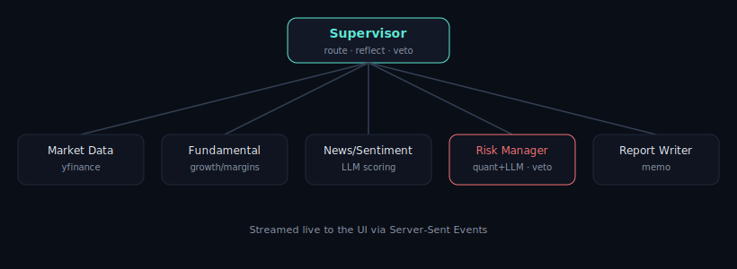

# ⚡ Autonomous Financial Analyst — a Hierarchical Multi-Agent System

### 🚀 [**Live demo →** financial-analyst-agent.onrender.com](https://financial-analyst-agent.onrender.com)
<sub>(free tier — may take ~30-50s to wake on first visit)</sub>

A **supervisor agent** orchestrates a team of six specialized agents to research any
publicly traded stock and produce a **risk-scored investment memo grounded in the
company's real SEC 10-K** — autonomously, with a live, streamed view of every agent's
reasoning and tool calls.

> _Educational research tool — not financial advice._



## Why this is interesting (engineering highlights)

- **Hierarchical multi-agent orchestration.** A supervisor routes work across Market Data,
  Fundamental, SEC Filings, News/Sentiment, Risk, and Report-Writer agents over a shared typed state.
- **Real LLM tool-calling.** The data-acquisition agent is given tool schemas and the LLM
  *autonomously decides* to call `get_market_data` / `get_news`; results are fed back and the loop
  continues until it answers. Not a hardcoded pipeline.
- **RAG over real SEC 10-K filings.** The SEC Filings agent fetches the latest 10-K from EDGAR,
  chunks it, retrieves the most relevant passages with a from-scratch TF-IDF retriever, and produces
  an assessment **grounded in primary source with citations** — no hallucinated fundamentals.
- **Reflection loop.** The supervisor re-dispatches an agent if its output is low-confidence.
- **Risk agent with veto authority.** The Risk Manager blends a *deterministic* quant score
  (beta, volatility, valuation) with LLM judgment and can **veto** a recommendation, which the
  Report Writer is forced to honor.
- **Polished React UI.** A React + TypeScript + Tailwind frontend renders an animated agent-graph
  (nodes light up as each agent runs), a live SSE trace, a price chart, a radial risk gauge, a
  sentiment meter, and the cited memo — every step streaming in real time.
- **Eval harness.** `evals/run_eval.py` reports coverage, latency, and veto rate over a ticker basket.
- **Runs with zero credentials.** No key? Deterministic **MOCK mode** (mock LLM + synthetic data)
  keeps everything working end-to-end. Add a free **Groq** key for **LIVE mode**.

## Architecture

```
                    ┌─────────────────┐
   "AAPL"  ───────► │   Supervisor    │  route • reflect • aggregate • enforce veto
                    └────────┬────────┘
     ┌──────────┬───────────┼───────────┬───────────┬──────────────┐
     ▼          ▼           ▼           ▼           ▼              ▼
  Market Data  Fundamental SEC Filings  News &     Risk Manager   Report
   (tool-       Analyst     RAG/10-K    Sentiment  (veto power)    Writer
   calling)     (LLM)       (EDGAR)     (LLM)      (quant+LLM)     (LLM)
```

The graph is a **hand-rolled, LangGraph-style state machine** (`backend/graph.py`). Implementing
it directly keeps dependencies tiny and the control flow fully inspectable; swapping in `langgraph`
is trivial since the node/edge model is identical.

## Tech stack

**Backend:** Python · FastAPI · Server-Sent Events · **Groq** (free, OpenAI-compatible) / Claude ·
LLM tool-calling · from-scratch TF-IDF RAG · SEC EDGAR · yfinance
**Frontend:** React · TypeScript · Tailwind CSS · Recharts · Framer Motion
**Infra:** Docker (multi-stage build) · Render

## Quickstart

```bash
cd financial-analyst-agent

# 1. backend
python3 -m venv .venv && source .venv/bin/activate
pip install -r backend/requirements.txt

# (optional) enable LIVE mode with a FREE Groq key from https://console.groq.com/keys
cp .env.example .env            # paste GROQ_API_KEY=...
set -a && . ./.env && set +a    # load it

# 2. build the frontend (served by FastAPI in production)
cd frontend-react && npm install && npm run build && cd ..

# 3. run
python -m backend.server        # open http://localhost:8000
```

**Frontend dev mode** (hot reload, proxies API to :8000):

```bash
cd frontend-react && npm run dev      # http://localhost:5173
```

Run the eval harness:

```bash
python -m evals.run_eval
```

## Deploy (free)

The repo ships a `Dockerfile` and `render.yaml`. On [Render](https://render.com):
**New → Blueprint → pick this repo**, then set `GROQ_API_KEY` as a secret. The service exposes
`/api/health` for health checks and reads `$PORT` automatically. (Also works on Railway / Fly via
the same Dockerfile / Procfile.)

## Project layout

```
backend/
  agents/        market_data (tool-calling), fundamental, filings (RAG), news_sentiment,
                 risk_manager (veto), report_writer
  tools/         market_tools (yfinance + fallback), sec_tools (EDGAR 10-K fetch)
  rag.py         from-scratch TF-IDF chunker + retriever (no heavy deps)
  graph.py       supervisor / orchestrator (state graph + reflection loop)
  llm.py         Groq/Claude wrapper + tool-calling loop + deterministic mock fallback
  server.py      FastAPI + SSE streaming + serves the built SPA
frontend-react/
  src/components/  Nav, Hero, Analyzer, AgentGraph, TracePanel, RiskGauge, PriceChart,
                   SentimentMeter, Filings, Memo, HowItWorks, Architecture, Footer
  src/api.ts       typed SSE client + React hooks
evals/
  run_eval.py    multi-ticker coverage / latency / veto-rate report
Dockerfile · render.yaml · Procfile   deployment (multi-stage: node build + python)
```

## Resume bullet

> Built a full-stack hierarchical multi-agent system (supervisor + 6 specialized agents) for
> autonomous equity research: implemented **real LLM tool-calling**, **RAG over SEC 10-K filings**
> (from-scratch TF-IDF retriever) for source-grounded analysis, a **risk-veto** mechanism, and a
> reflection loop; built a **React + TypeScript** UI with an animated agent-graph and live SSE
> streaming, containerized with a multi-stage **Docker** build, deployed on Render, and added an
> eval harness measuring coverage, latency, and veto rate.
